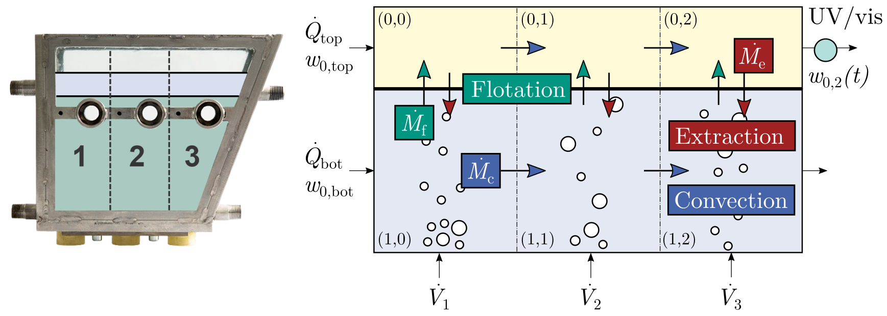

# ATPF Process Model
Process model for the continuous aqueous two-phase flotation (ATPF).

## Authors
Kim Lohfink, Hermann Nirschl, Frank Rhein* \
[Correspondence](mailto:frank.rhein@kit.edu)

## More Information
More information on model development, calibration and the discussion of the results can be found in the accompanying publication, available as preprint [here](about:blank) 

## Subfolders in this repository
- `./atpf/`: Contains the core functionality of the Solver
- `./config/`: Default path for config files to define simulation parameters
- `./data/`: Folder for raw and processed data
- `./tests/`: Simple files showcasing the general usage of the package

## Getting started
Two simple test cases for batch and continuous operation are found in the `./tests/` subfolder. In order to reproduce the results of the study, please see the `./atpf/utils/atpf_calib.py` file, where the sensitivity analysis is performed and model parameters are optimized. The empirical correlations described in the methods section are found in the `./atpf/utils/atpf_models.py` file.

## Data 
Data used in this repository is published under the (TBD) license here: TBD (DOI: TBD). It is simply downloaded and extracted to the `data/` folder in this repository. 

